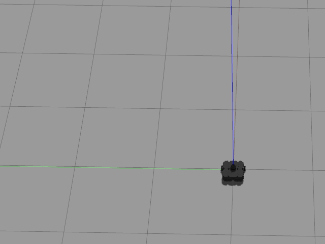

# Warmup Project
## Driving in a Square
### Description
The goal is to write a ROS node that commands the Turtlebot3 robot to drive a square path. I accomplish this by using timed moving, i.e., move forward for a fixed amount of time then make a 90 degree turn four times.
### Code explanation
`DriveSquare` class is the ROS node that drives the robot in a square. Its `__init__` method starts the rospy node, gets a publisher to the `/cmd_vel` topic and defines several `Twist` variables that will be used to control the robot movement. The `run` method is called once the node is up. It implements the behavior as detailed in <a href="#desc">Description</a>. To make the robot more stable, the robot is also made to stop for 1 sec between forward movement and turning.
### GIF demo

